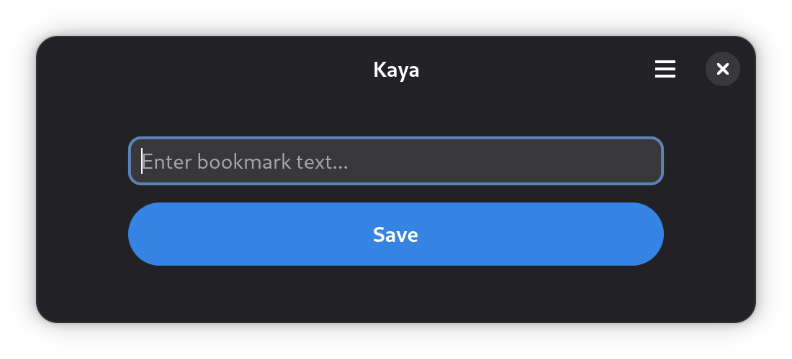

# Kaya

Kaya is a local-first bookmarking system. Sort of. It might be described as the most insanely oversimplified bookmarking system in existence.



## Architecture

The Kaya architecture is defined in Architectural Decision Records, or ADRs. You can find a chronological list of ADRs in [doc/arch](doc/arch).

### Data Model

The local disk is the only source of truth. Kaya's records ("anga") are stored in the following layout:

* `~/.kaya/anga` = bookmarks, notes, PDFs, images, and other files
* `~/.kaya/meta` = human tags and metadata for anga records
* `~/.kaya/cache` = local copies of bookmarked webpages
* `~/.kaya/smart` = computer-generated metadata
* `~/.kaya/space` = collections of bookmarks, notes, and files

Both `/anga` and `/meta` are records the user has entered -- they are immutable, and precious. Both `/cache` and `/smart` are computer-generated -- they are ephermal and can be recreated from files in `/anga` and `/meta` at any time. `/space` contains collections, which are human-defined but may contain anga which were automatically added based on filters.

### Data Model: /anga

Please see [doc/arch/adr-0001-core-concept.md](doc/arch/adr-0001-core-concept.md).

### Data Model: /meta

Each file in `~/.kaya/meta` is a [.toml](https://toml.io/en/) file with the following format:

```toml
[anga]
filename = "2026-01-28T205208-bookmark.url"

[meta]
tags = ["podcast", "democracy", "cooperatives"]
note = '''This is a longer note, containing a reminder to myself that I was a guest on this podcast.

It can be multi-line and uses single quotes to prevent escaping.'''
```

## Setting Up Your Development Environment

### Prerequisites: TypeScript & `gi-types`

```bash
npm install -g typescript
make setup
```

### Zed

If you want to be a little more bleeding edge, you can install [Zed](https://zed.dev/). It's also well-supported for JavaScript
and TypeScript development but does not support Flatpak.

* _TypeScript, ESLint, and Prettier support is built into Zed_
* [Additional ESLint instructions](https://github.com/zed-industries/zed/discussions/35888) and [format-on-save instructions](https://github.com/zed-industries/zed/discussions/13602)
* XML by `sweetppro`
* Meson by Hanna Rose
* As of this writing, Zed has no Flatpak extension

### Flatpak

You will also need to install the GNOME Nightly flatpak SDK and the Node and Typescript
SDK extensions. First, add the flatpak repositories if you have not already configured them.
(Beta is optional.) In a terminal, run:

```
$ flatpak remote-add --user --if-not-exists flathub https://flathub.org/repo/flathub.flatpakrepo
$ flatpak remote-add --user --if-not-exists flathub-beta https://flathub.org/beta-repo/flathub-beta.flatpakrepo
$ flatpak remote-add --user --if-not-exists gnome-nightly https://nightly.gnome.org/gnome-nightly.flatpakrepo
```

Then install the SDKs and extensions:

```
$ flatpak --user install org.gnome.Sdk//master org.gnome.Platform//master
$ flatpak --user install org.freedesktop.Sdk.Extension.node24//25.08 org.freedesktop.Sdk.Extension.typescript//25.08 org.freedesktop.Sdk.Extension.rust-stable//25.08
```

Also ensure that you have `flatpak-builder` installed:

```
$ sudo apt install flatpak-builder         # or whatever is appropriate on your distro
```

### Flathub

Install the stable platform and SDK:

```
$ flatpak install -y flathub org.flatpak.Builder
$ flatpak --user install org.gnome.Sdk//48 org.gnome.Platform//48
```

### Node Package Manager & ESLint

This step is optional, but highly recommended for setting up linting and code formatting.
Install `npm`, then run `npm install` in your project directory.

## Building & Running Your App

### In VS Code

When you open your project directory in VS Code, you should see a box icon on the bottom left
of your screen with your application ID. If you see this and no errors, that means that the
flatpak VS Code extension properly loaded your project.

Open your command palette (View -> Command Palette in the menu bar, or Ctrl+Shift+P) and
type "Flatpak". Select "Flatpak: Build" from the list. Once the build is done, open the
command palette again and select "Flatpak: Run". You should see the window depicted in
the screenshot at the top of this file.

After your initial build, you can use the "Flatpak: Build and Run" action from the
command palette to do both steps at once.

### Prerequisites

Initialize the submodule with TypeScript definitions ( `gi-typescript-definitions`):

```
$ git submodule update --init
$ pip install meson
$ yarn install
```

### Flatpak Build

To build and run the application, run:

```
$ make build
$ make install
$ make run
```

### macOS Build

To build and run on macOS, first install dependencies via Homebrew:

```
$ make macos-deps
```

Then build the `.app` bundle and run it:

```
$ make macos-build
$ make macos-run
```

To create a `.dmg` installer:

```
$ make macos-dmg
```

### Flathub Release

* `/bin/release.rb`

## Dev Process

You'll need to remember to add new files to these locations:

* `/src/{filename}.ts`
* `/src/meson.build`
* `/src/ca.deobald.Kaya.src.gresource.xml`

## References

For the next steps in your application development journey, visit the following links:

* Read our [Developer Documentation](https://developer.gnome.org/documentation/) for tutorials and references.
* Read our [Human Interface Guidelines](https://developer.gnome.org/hig/) to learn the best practices for designing a GNOME application.
* Visit [gjs.guide](https://gjs.guide/) for a comprehensive overview of GJS.
* If you plan to host your repo on GitHub, set up [flatpak-github-actions](https://github.com/flatpak/flatpak-github-actions).
